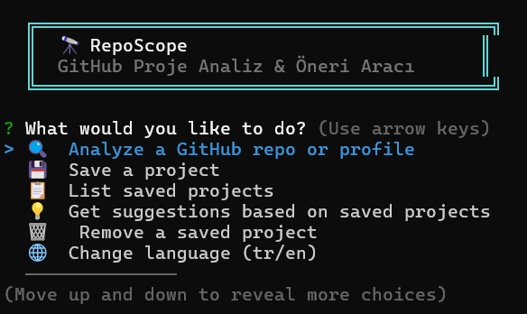

<div align="center">

# 🔭 RepoScope

**AI-powered GitHub repository & profile analyzer CLI**

GitHub repolarını ve profillerini yapay zeka ile analiz eden, proje öneren komut satırı aracı.

[](https://nodejs.org)
[](https://fireworks.ai)
[](LICENSE)



</div>

---

## 🇬🇧 English

### What is RepoScope?

RepoScope is an interactive CLI tool that connects to GitHub's API and uses AI (DeepSeek V4 via Fireworks AI) to deeply analyze any public repository or developer profile. It tells you what a project does, what tech it uses, who it's for, and even suggests similar projects based on your interests.

**In short:** Paste a GitHub link → Get an AI-powered breakdown in seconds.

### Features

| Feature | What it does |
|---------|-------------|
| **Repo Analysis** | Fetches repo metadata + README, sends it to AI for a full breakdown (purpose, architecture, tech stack, quality score) |
| **Profile Analysis** | Analyzes a developer's public repos, detects expertise areas and technology preferences |
| **Save Projects** | Bookmark repos locally with auto-detected categories (Web Frontend, AI/ML, DevOps, etc.) |
| **Smart Suggestions** | AI recommends 5 real GitHub projects similar to your saved ones |
| **Bilingual** | Full Turkish & English support — switch anytime from the menu |

### Quick Start

```bash
# 1. Clone the repository
git clone https://github.com/oguzdeveloper/Repo-Scope.git
cd Repo-Scope

# 2. Install dependencies
npm install

# 3. Set up environment variables
cp .env.example .env
```

Open `.env` and add your keys:

```env
FIREWORKS_API_KEY=your_fireworks_api_key   # Required — get it free at https://fireworks.ai
GITHUB_TOKEN=your_github_token             # Optional — increases API rate limit (60 → 5000 req/hr)
LANGUAGE=en                                # Default language: en or tr
```

> **How to get a Fireworks API key:** Sign up at [fireworks.ai](https://fireworks.ai) → Dashboard → API Keys → Create.
>
> **How to get a GitHub token:** [github.com/settings/tokens](https://github.com/settings/tokens) → Generate new token (classic) → No scopes needed for public repos.

### Usage

```bash
# Interactive menu (recommended)
node src/index.js

# Quick analyze — paste any GitHub URL directly
node src/index.js https://github.com/vercel/next.js
node src/index.js https://github.com/torvalds
```

### Menu Walkthrough

When you run `node src/index.js`, you'll see:

```
  ╔══════════════════════════════════════════╗
  ║  🔭 RepoScope                           ║
  ║  GitHub Project Analyzer & Suggester     ║
  ╚══════════════════════════════════════════╝

? What would you like to do?
❯ 🔍  Analyze a repo/profile
  💾  Save a project
  📋  List saved projects
  💡  Get project suggestions
  🗑️  Remove a saved project
  🌐  Change language
  ❌  Exit
```

**Typical workflow:**

1. **Analyze** → Paste `https://github.com/facebook/react` → See AI-generated breakdown (what it does, architecture, who uses it)
2. **Save** → Paste the same link → Project is bookmarked locally with auto-detected category "Web Frontend"
3. **Suggest** → AI looks at your saved projects and recommends 5 real GitHub repos you might like
4. **List** → View all your saved projects with metadata
5. **Remove** → Clean up projects you no longer care about

### Project Structure

```
RepoScope/
├── src/
│   ├── index.js          # Main entry — CLI menu & all command handlers
│   ├── config.js         # Environment config loader
│   ├── services/
│   │   ├── github.js     # GitHub API client (repos, profiles, README fetch)
│   │   ├── ai.js         # Fireworks AI client (analysis, suggestions)
│   │   └── storage.js    # Local JSON storage for saved projects
│   └── i18n/
│       ├── index.js      # Language switcher
│       ├── tr.js         # Turkish translations
│       └── en.js         # English translations
├── .env.example          # Template for environment variables
├── package.json
└── README.md
```

---

## 🇹🇷 Türkçe

### RepoScope Nedir?

RepoScope, herhangi bir GitHub reposunun veya geliştiricinin profilinin linkini yapıştırmanız yeterli olan interaktif bir CLI aracıdır. GitHub API'den veriyi çeker, yapay zekaya (DeepSeek V4) gönderir ve size projenin ne yaptığını, hangi teknolojileri kullandığını, kimin işine yarayacağını detaylıca anlatır.

**Kısaca:** GitHub linki yapıştır → Saniyeler içinde AI destekli detaylı analiz al.

### Özellikler

| Özellik | Ne yapar? |
|---------|-----------|
| **Repo Analizi** | Reponun metadata + README'sini alır, AI'a gönderir → Amaç, mimari, teknoloji, kalite puanı döner |
| **Profil Analizi** | Bir geliştiricinin tüm public repolarını inceler, uzmanlık alanlarını ve teknoloji tercihlerini tespit eder |
| **Proje Kaydetme** | Repoları otomatik kategori tespiti ile yerel olarak kaydet (Web Frontend, AI/ML, DevOps vb.) |
| **Akıllı Öneriler** | Kayıtlı projelerinize bakarak AI, ilginizi çekebilecek 5 gerçek GitHub projesi önerir |
| **Çift Dil** | Tam Türkçe & İngilizce desteği — menüden istediğiniz zaman değiştirin |

### Hızlı Başlangıç

```bash
# 1. Repoyu klonlayın
git clone https://github.com/oguzdeveloper/Repo-Scope.git
cd Repo-Scope

# 2. Bağımlılıkları yükleyin
npm install

# 3. Ortam değişkenlerini ayarlayın
cp .env.example .env
```

`.env` dosyasını açıp anahtarlarınızı girin:

```env
FIREWORKS_API_KEY=fireworks_api_anahtariniz   # Zorunlu — https://fireworks.ai adresinden ücretsiz alın
GITHUB_TOKEN=github_tokeniniz                 # Opsiyonel — API rate limitini artırır (60 → 5000 istek/saat)
LANGUAGE=tr                                   # Varsayılan dil: tr veya en
```

> **Fireworks API Key nasıl alınır:** [fireworks.ai](https://fireworks.ai)'a üye olun → Dashboard → API Keys → Create.
>
> **GitHub Token nasıl alınır:** [github.com/settings/tokens](https://github.com/settings/tokens) → Generate new token (classic) → Public repolar için scope seçmenize gerek yok.

### Kullanım

```bash
# İnteraktif menü (önerilen)
node src/index.js

# Hızlı analiz — direkt GitHub linki yapıştırın
node src/index.js https://github.com/vercel/next.js
node src/index.js https://github.com/torvalds
```

### Menü Rehberi

`node src/index.js` yazdığınızda şunu görürsünüz:

```
  ╔══════════════════════════════════════════╗
  ║  🔭 RepoScope                           ║
  ║  GitHub Proje Analiz & Öneri Aracı      ║
  ╚══════════════════════════════════════════╝

? Ne yapmak istiyorsunuz?
❯ 🔍  Repo/profil analiz et
  💾  Proje kaydet
  📋  Kayıtlı projeleri listele
  💡  Proje önerisi al
  🗑️  Kayıtlı proje sil
  🌐  Dil değiştir
  ❌  Çıkış
```

**Tipik kullanım senaryosu:**

1. **Analiz** → `https://github.com/facebook/react` yapıştırın → AI tarafından oluşturulmuş detaylı analiz (ne yapar, mimarisi, kim kullanır)
2. **Kaydet** → Aynı linki yapıştırın → Proje "Web Frontend" kategorisinde otomatik olarak kaydedilir
3. **Öneri** → AI kayıtlı projelerinize bakar ve ilginizi çekebilecek 5 gerçek GitHub reposu önerir
4. **Liste** → Tüm kayıtlı projelerinizi metadata ile görüntüleyin
5. **Sil** → Artık ilgilenmediğiniz projeleri listeden çıkarın

### Proje Yapısı

```
RepoScope/
├── src/
│   ├── index.js          # Ana giriş — CLI menü ve komut işleyiciler
│   ├── config.js         # Ortam değişkeni yükleyici
│   ├── services/
│   │   ├── github.js     # GitHub API istemcisi (repo, profil, README çekme)
│   │   ├── ai.js         # Fireworks AI istemcisi (analiz, öneri)
│   │   └── storage.js    # Kayıtlı projeler için yerel JSON depolama
│   └── i18n/
│       ├── index.js      # Dil değiştirici
│       ├── tr.js         # Türkçe çeviriler
│       └── en.js         # İngilizce çeviriler
├── .env.example          # Ortam değişkenleri şablonu
├── package.json
└── README.md
```

---

## 🛠️ Tech Stack

| Component | Technology |
|-----------|-----------|
| Runtime | Node.js |
| AI Engine | Fireworks AI — DeepSeek V4 |
| Data Source | GitHub REST API v3 |
| CLI UX | Inquirer.js (interactive prompts) |
| Styling | Chalk (colors), Ora (spinners) |
| HTTP | Axios |
| Config | dotenv |

## ⚠️ Notes

- **Fireworks API Key is required** for AI features (analysis & suggestions). Without it, only GitHub data fetching works.
- **GitHub Token is optional** but recommended. Without it, you're limited to 60 API requests per hour. With it, you get 5000.
- Saved projects are stored locally in `data/projects.json` (auto-created on first save).
- The tool only accesses **public** GitHub data. No private repos are ever accessed.

## 📄 License

[MIT](LICENSE) — Use it, fork it, build on it.
